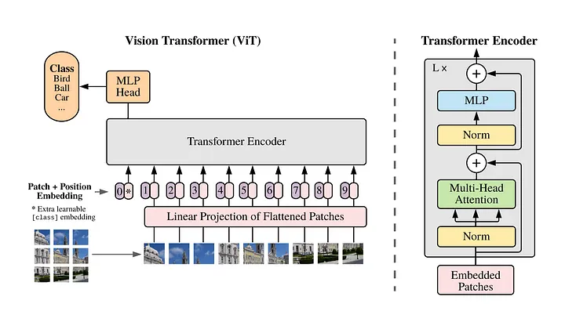
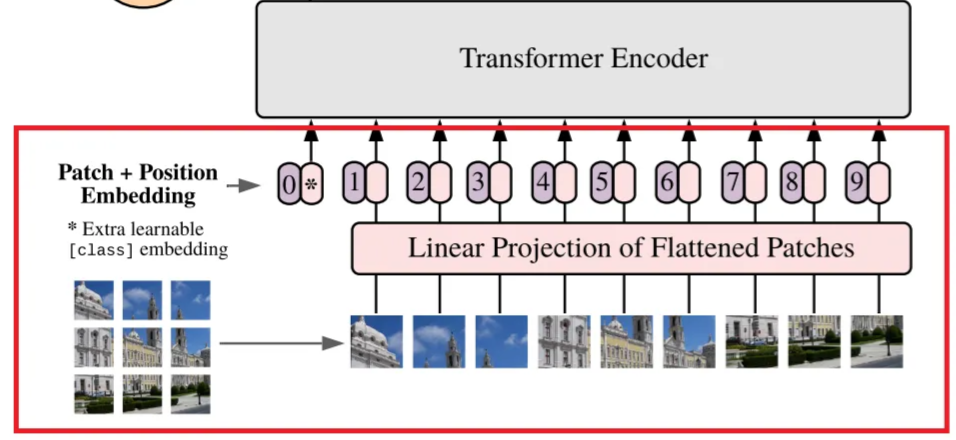
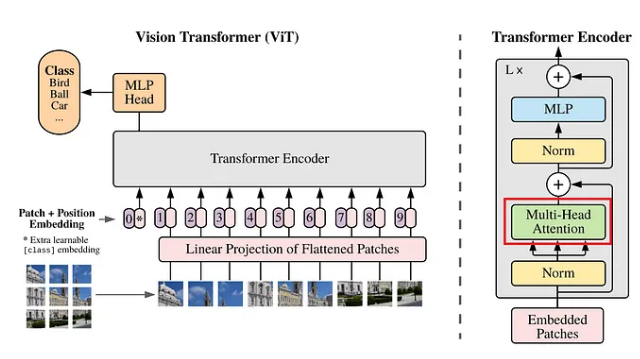

# Vision Transformer(ViT) 

This is a PyTorch implementation of the paper [An Image is Worth 16x16 Words: Transformers for Image Recognition at Scale]https://arxiv.org/abs/2010.11929). The goal of this project is to provide a simple implementation of the paper.

# Table of Contents
[Theory Explanation](#TE)
   - [Create Embeddings](#Emb)
   - [Multi-head Attention](#MHA)
   - [Image classification](#CLS)

[Usage](#Usage)

## Theory Explanation 
The architecture of this model is inspired by the BERT language architecture. 
The basic idea behind this approach is that the input image can be viewed as a series of patches that then represent "tokens" that can be further processed through the Attention architecture, which was created for the needs of NLP problems.

  

In the following, through several steps, we will explain to the general pipline what we want to do on a theoretical level.

### Create Embeddings 

The first step is that we want to divide the input image into a network of non-overlapping patches, and then project each patch linearly in order to obtain an embedded vector of a certain size.

  

### Multi-head Attention 

Before going through the depth of transformer, we first explore the multi-head attention module, 
which is its core component. The multi-head attention is used to compute the interactions between 
different patches in the input image. The multi-head attention consists of multiple attention heads, 
each of which is a single attention layer.

The module takes a sequence of embeddings as input and computes query, key, and 
value vectors for each embedding. The query and key vectors are then used to compute the 
attention weights for each token. The attention weights are then used to compute new 
embeddings using a weighted sum of the value vectors. We can think of this mechanism as a 
soft version of a database query, where the query vectors find the most relevant key vectors in the database, 
and the value vectors are retrieved to compute the query output.

  

### Image classification 

After inputting the image to the embedding layer and transformer encoder, 
we obtain new embeddings for both the image patches and the [CLS] token. At this point, 
the embeddings should have some useful signals for classification after being processed by the transformer encoder. 
Similar to BERT, we’ll use only the [CLS] token’s embedding to pass to the classification layer.

The classification layer is a fully connected layer that takes the [CLS] embedding as input and 
outputs logits for each image. The following code implements the ViT model for image classification.

## Usage

## Results